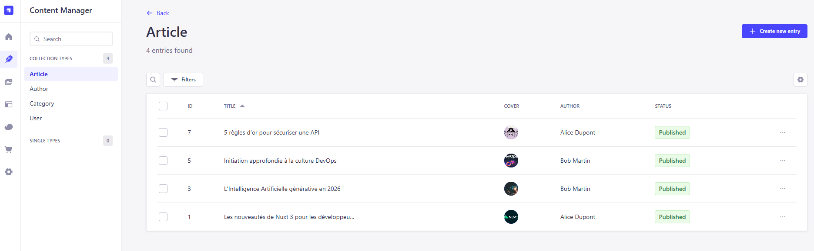
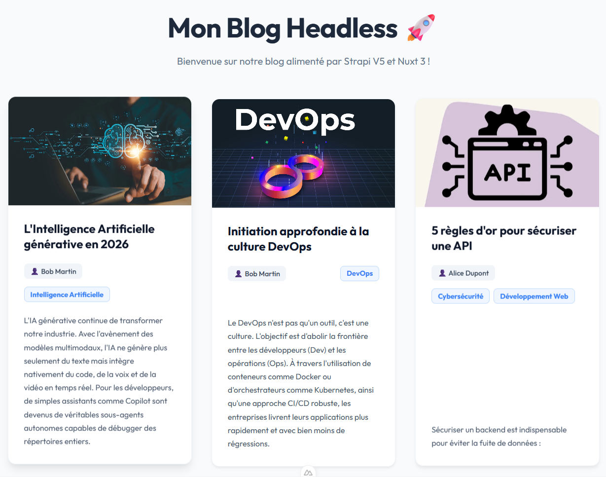
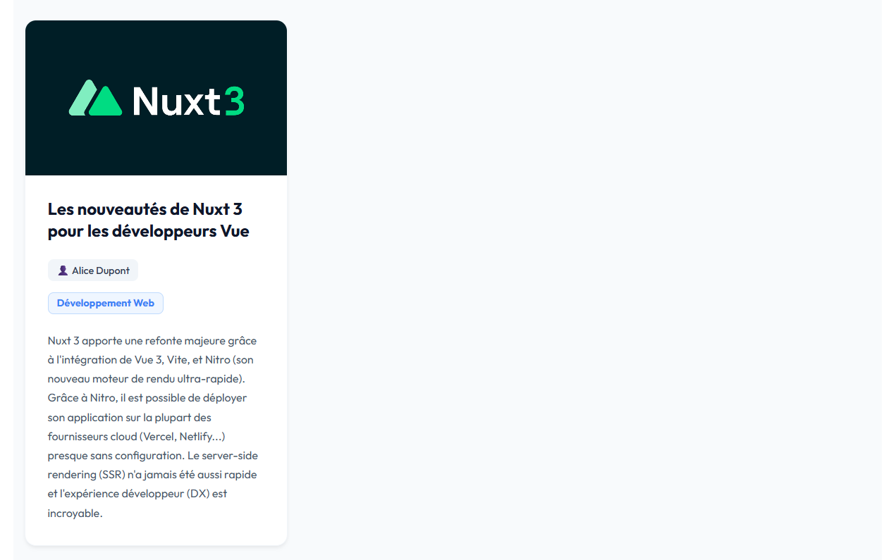

# TP : Découverte de Strapi, un CMS Headless

> Projet réalisé dans le cadre du TP - Spécialité Web JS / BUT3
> 
> IUT Charlemagne - Université de Lorraine

- Réalisé par : **[Vivien Herrmann](https://github.com/Vivienhrm)**


Bienvenue sur ce projet ! L'objectif ici était d'explorer l'architecture Headless CMS en séparant le back-office du front-end dans le cadre d'un blog Tech. 

Il s'agissait donc de créer :
- D'une API de gestion de contenu (Back-End) propulsée par **Strapi** et une base de données locale **SQLite**.
- D'une interface de consultation (Front-End) développée avec **Nuxt 3**.


## Pré-requis

- Node.js
- Npm (ou yarn / pnpm)

## Installation et démarrage

Le dépôt contient deux sous-dossiers distincts : `mon-blog-backend` (le serveur Strapi) et `mon-blog-frontend` (le client Nuxt). **Il est nécessaire de lancer les deux en même temps dans deux terminaux séparés.**

1. **Cloner le projet**
```bash
git clone https://github.com/Vivienhrm/tp-strapi-nuxt.git
cd tp-strapi-nuxt
```

---

### Lancer le Back-End (Strapi)

Le dossier Strapi contient déjà la base de données SQLite (`data.db`) avec les schémas des collections (Author, Category, Article) et les données de test associées.

Dans un **premier terminal** :
```bash
cd mon-blog-backend
npm install
npm run develop
```
*Le **fichier .env** doit être créé à partir du **.env.example** et doit contenir les clés d'API et les clés de chiffrement. Le port de Strapi a été configuré sur le port `1338` dans le `.env`.*

- Panel d'administration Strapi : `http://localhost:1338/admin`
- Endpoint API des articles : `http://localhost:1338/api/articles?populate=*`

*Vous pourrez ensuite **ajouter, modifier ou supprimer** des articles, des catégories et des auteurs depuis l'interface d'administration. Vous trouverez les images utilisés pour mes blogs dans le dossier `mon-blog-frontend/public/images`.*


---

### Lancer le Front-End (Nuxt 3)

Le projet Nuxt interroge l'API Strapi locale lors du rendu côté serveur pour afficher les articles avec toutes leurs métadonnées (auteurs, catégories, images).

Dans un **deuxième terminal** (en laissant tourner Strapi) :
```bash
cd mon-blog-frontend
npm install
npm run dev
```

- Blog en ligne (l'interface publique) : `http://localhost:3000` *(ou `3001` si le 3000 est occupé).*

---

## Rendu final
> **Aperçu de l'interface d'administration Strapi :**
> 

> **Aperçu du Blog :**
> 
> 
